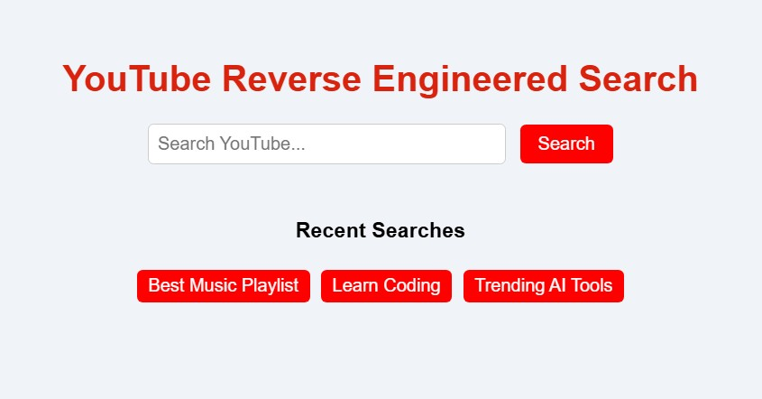

# 🎥 YouTube Reverse Engineering - Video Search App

This is a beginner-friendly web project that **mimics YouTube video search functionality** using a third-party API. Built with **HTML, CSS, and JavaScript**, and powered by the **RapidAPI YouTube Search Results API**, this project demonstrates how you can simulate the behavior of YouTube search without using their official API.

---

## 🌟 Features

- 🔍 Search YouTube-style videos using any keyword
- 📡 Fetch results from a reverse-engineered YouTube search API
- 🖼️ Display results with thumbnails, titles, and clickable links
- 💄 Styled with modern CSS for a clean and responsive UI

---

## 🛠️ Tech Stack

- HTML
- CSS
- JavaScript (ES Modules)
- [Vite](https://vitejs.dev/) – Development build tool
- [RapidAPI - YouTube Search Results API](https://rapidapi.com/h0p3rwe/api/youtube-search-results/)

---

## 🚀 Getting Started

### 🔧 Prerequisites

Make sure you have the following installed:

- [Node.js](https://nodejs.org/) (v16 or above)
- npm (comes with Node.js)

---

### 📦 Installation

1. **Clone this repository** or [Download the ZIP](https://github.com/NeoAnthem/youtube-reverse-engineering/archive/refs/heads/main.zip)

   ```bash
   git clone https://github.com/NeoAnthem/youtube-reverse-engineering.git
   cd youtube-reverse-engineering

Install dependencies using npm:
npm install

Start the development server:
npm run dev

Open your browser and go to:
http://localhost:5173

🔑 API Key Setup
By default, the API key is already set in api.js: 
"X-RapidAPI-Key": "your_api_key_here"

If you want to use your own key, replace the value above with your RapidAPI key.

📁 Project Structure :

    📦 youtube-reverse-engineering
        ├── index.html           # Main HTML file
        ├── app.js               # Client-side JavaScript logic
        ├── api.js               # API call setup using fetch
        ├── style.css            # Custom CSS styling
        ├── vite.config.js       # Vite configuration
        ├── package.json         # Project metadata and dependencies
        ├── pic.jpg              # Preview image
        └── README.md            # This file

📸 Preview :



🧠 What You’ll Learn :

- How to reverse engineer API functionality
- How to work with unofficial APIs
- How to build a simple frontend app using modern JavaScript
- Basic use of Vite for development

🤝 Contributing
If you’re a beginner or experienced developer, feel free to fork the repo and submit a pull request. Contributions are welcome!